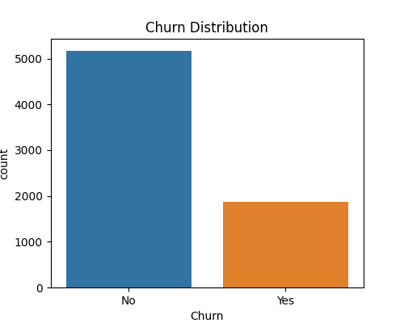
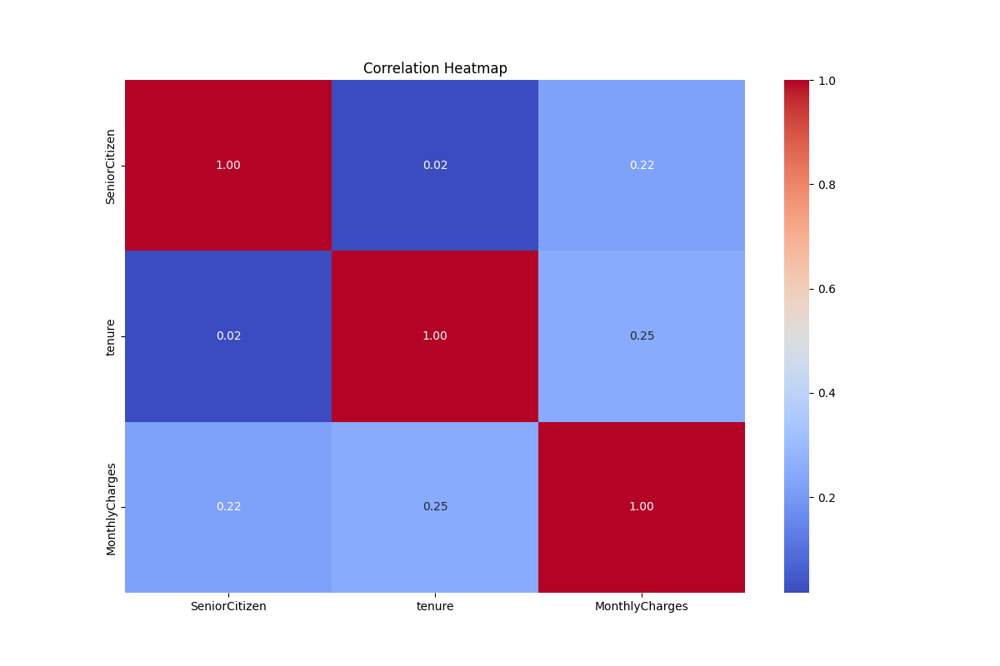

# 🔹 Step 2 – Data Preparation

## Objective
Clean and preprocess the raw data to make it usable for downstream tasks.

## Process
- Understand the distribution of data

- Plot the correlation between groups

- Remove duplicates.  
- Handle missing values:  
  - Numeric → mean/median imputation.  
  - Categorical → mode or placeholder.  
- Standardize categorical values (case normalization).  
- Convert data types (e.g., dates, numeric fields).  

## Implementation Highlights
- Implemented in Airflow as `data_preparation.py`.  
- Generates logs of missing values and corrections.  
- Outputs a cleaned dataset for transformation.  

## Challenges & Solutions
- **Challenge:** High percentage of missing values in demographics.  
  **Solution:** Median-based imputation for numerical and group-based imputation for categorical.  

- **Challenge:** Inconsistent formats (dates, string case).  
  **Solution:** Centralized formatting functions applied at preprocessing.  
